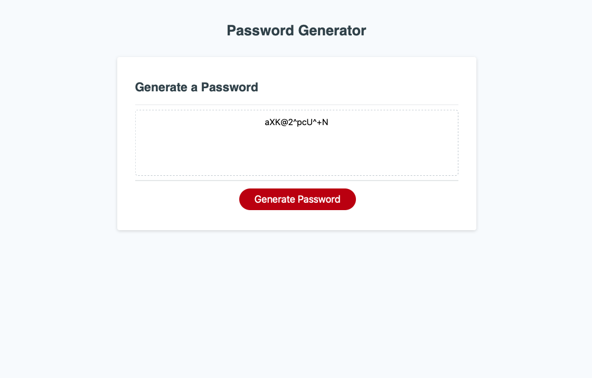

# hw-3

Password Generator:
Click generate then answer the pop-up boxes to generate a random password with the properties of your choosing.

Created by David Ludwik

The program takes in the length of desired password as well as the categories of characters the user would like to have included.
All input is checked for validity before progression.
An aggregated array of all acceptable characters is assembled, from which the desired number of characters are picked randomly.
Keep clicking generate to get a new password to the same specifications, or refresh the page to input new ones.

